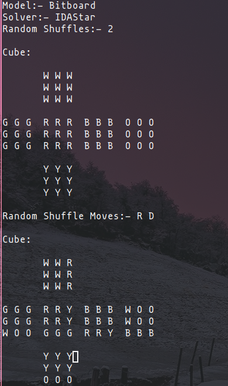

# Rubix Cube Solver
- A Rubik's Cube solver written in C++
- It uses various models to represent the Rubik's cube, all with different efficiencies of operations
- Also uses various solver algorithms to solve a shuffled cube.

[//]: # (- Uses FTXUI library to display the cube and operations as a TUI)

## Models
1. 3D Array
    - Simplest implementation
    - A 6x3x3 array to store color of each cubie for each face
    - Least efficient because operations are expensive
2. 1D Array
    - The 3D array flattened to 1 dimension
    - Just a 1x54 array to store color to store the color of each cubie
    - Slightly more efficient, because of data being stored in contiguous memory
    - But also requires coverting cubie address to array index
3. Bitboard
    - Quite complex implementation
    - Uses 6 bit arrays to represent each faces of the cube
    - Each 64 bit integer represent a face of the cube
    - Each 8 bit of the integer represent the 8 cubies of the face in clockwise order, excluding the middle
    - The 6 color are assigned an index from 0-6, and that index is made 1 in the bit array to represent the color of the cubie
    - Rotation of faces involves doing circular left shift

## Solvers
1. BFS
    - Uses Bredth First Search to solve the cube
    - Memory requirement is quite high as it has to keep track of all neighbours i.e. moves
    - Is quite efficient if solution is near the root i.e. the shuffled cube
2. DFS
    - Uses Depth First Search to solve the cube
    - Slower to find solution if in the latter neighbours of root, but near the root
    - Memory requirement is quite less compared to BFS
3. IDDFS
    - Uses Iterative Deepening Depth First Search to solve the cube
    - This algorithms runs DFS repeatedly but with max depth set to different value each time, starting from 1 and then increasing it by 1 each time
    - Combines the benefits of BFS and DFS
    - Memory requirement is quite less compared to BFS
    - More efficient than DFS if solution is latter neighbours of root, but near the root
4. IDAStar
    - Uses Iterative Deepening A* to solve the cube
    - Like A* algorithm uses corner pattern database as heuristic
    - But runs it multiple times with increasing max bound each time
    - Memory requirement is similar to BFS
    - But is the quite fast at solving cube compared to other algorithms due to use of heuristic

## Display

### CLI
- Default display
- Prints cubies colors as characters on the terminal

`CubeSolver -r 2`

